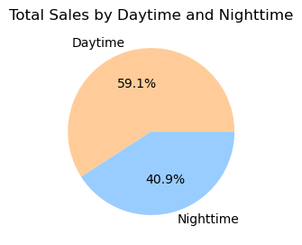
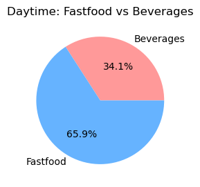
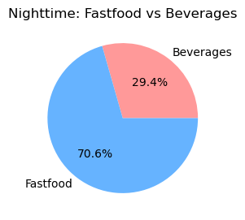

# Balaji Fast food Sales

## **Overview** 
- 1.Load the data: Load the CSV file into a pandas DataFrame.
- 2.Removing rows with missing values (NaN) from the dataset
- 3.Categorizing sales into daytime and nighttime
- 4.Group by time and items:
- 5.Visualize the data (Optional):
  * 5.1 Total Sales Distribution by Time of Sale
  * 5.2 Daytime: Menu vs Beverages
  * 5.3 Nighttime: Menu vs Beverages

## **About dataset**           
This dataset provides sales information for Balaji Fast Food Restaurant, including various food items. The dataset includes the following fields:
- The data is a CSV file with 10 columns and 1001 rows.
    * Date
    * Item Name
    * Item Type
    * Item Price
    * Quantity
    * Transaction Amount
    * Transaction Type
    * Received By
    * Time of Sale
  

## **Objective**
 To explore sales data of menu items in restaurants during day and night and predict which food and beverage items customers buy during day and night and at what price in 'Balaji Fast Food' restaurants the most.

## 1.Load the data: Load the CSV file into a pandas DataFrame.
Load the CSV file into a pandas DataFrame using the pd.read_csv() function. This function reads the CSV file and creates a DataFrame, which allows for easy data manipulation and analysis.

## 2.Removing rows with missing values (NaN) from the dataset.
Removing Rows with Missing Values,Remove any rows that contain missing values (NaN) from the dataset using the dropna() method. This ensures that subsequent analyses are based on complete data.

<class 'pandas.core.frame.DataFrame'>
Index: 893 entries, 1 to 999
Data columns (total 10 columns):
| #  | Column            | Non-Null Count | Dtype  | 
|----|-------------------|----------------|--------|
| 0   | order_id          |  893 non-null  | int64  |
| 1   | date              |  893 non-null  | object |
| 2   | item_name         |  893 non-null  | object |
| 3   | item_type         |  893 non-null  | object |
| 4   | item_price        |  893 non-null  | int64  |
| 5   | quantity          |  893 non-null  | int64  |
| 6   | transaction_amount|  893 non-null  | int64  |
| 7   | transaction_type  |  893 non-null  | object |
| 8   | received_by       |  893 non-null  | object |
| 9   | time_of_sale      |  893 non-null  | object |

dtypes: int64(4), object(6)
memory usage: 76.7+ KB

## 3.Categorizing sales into daytime and nighttime.
Create a new column in the DataFrame to categorize sales as either daytime or nighttime based on the time of sale. This categorization allows for easier analysis of sales patterns throughout the day.

| **day_or_night** | **time_of_sale**    |
|------------------|---------------------|
| Daytime          | Afternoon       205 | 
|                  | Morning         190 |
|                  |                     | 
| Nighttime        | Evening         201 |
|                  | Midnight        199 |
|                  | Night           205 |
|    Name: order_id, dtype: int64        |

## 4.Group by time and items.
Group the data by the newly created Time_Category and item name to aggregate sales data. This step helps to summarize the total sales amount and quantity for each item during daytime and nighttime.
                                  
| **sales_by_time** |  **item_name** | **item_type** | **quantity** | **item_price**|                
|-------------------|----------------|---------------|--------------|---------------|
| Daytime           | Cold coffee    | Beverages     |  859         | 40            |
|                   | Sugarcane juice| Beverages     |  814         | 25            |
|                   | Panipuri       | Fastfood      |  704         | 20            |
|                   | Frankie        | Fastfood      |  682         | 50            |
|                   | Sandwich       | Fastfood      |  604         | 60            |  
|                   | Vadapav        | Fastfood      |  588         | 20            |
|                   | Aalopuri       | Fastfood      |  577         | 20            |
|                   |                |               |              |               |
| Nighttime         | Panipuri       | Fastfood      |  522         | 20            |
|                   | Cold coffee    | Beverages     |  502         | 40            |
|                   | Sandwich       | Fastfood      |  493         | 60            |
|                   | Frankie        | Fastfood      |  468         | 50            |
|                   | Aalopuri       | Fastfood      |  467         | 20            |
|                   | Sugarcane juice| Beverages     |  464         | 25            |
|                   | Vadapav        | Fastfood      |  418         | 20            |

## 5.Visualize the data (Optional):
Visualizations can provide insights into sales patterns. Using libraries like Matplotlib or Seaborn, you can create several types of plots:
  * 5.1 Total Sales Distribution by Time of Sale
  Visualize the overall sales distribution across different times of the day to identify peak sales periods.

  

  * 5.2 Daytime: Menu vs Beverages
  Compare the sales of menu items against beverages during the daytime to determine which category performs better.

  

  * 5.3 Nighttime: Menu vs Beverages
  Similar to daytime, analyze nighttime sales to observe differences in consumer preferences.

  

